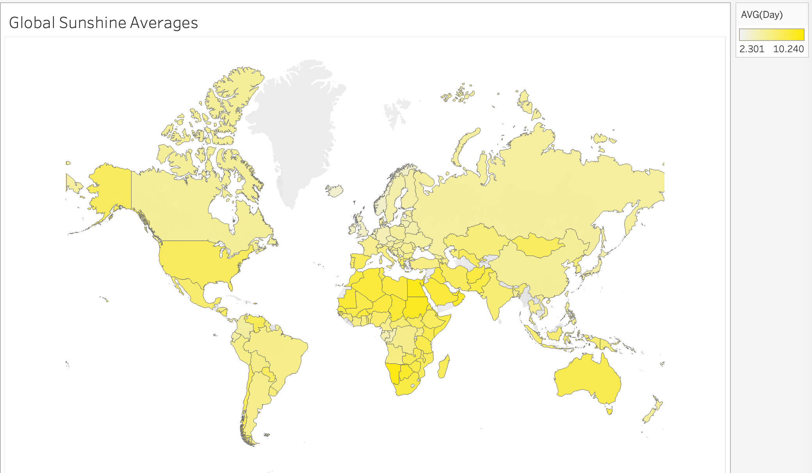

# Global Sunshine Hours

This project looks at sunshine duration in cities across the globe using [this dataset from Wikipedia](https://public.tableau.com/views/GlobalSunshineHours/GlobalSunshineAverages?:language=en-US&publish=yes&:display_count=n&:origin=viz_share_link). I converted the tables to pandas dataframes, combined all of the continents into one large dataframe, and performed some minor cleanup. 

My visualizations for this dataset can be found on [Tableau Public](https://public.tableau.com/views/GlobalSunshineHours/GlobalSunshineAverages?:language=en-US&publish=yes&:display_count=n&:origin=viz_share_link).

